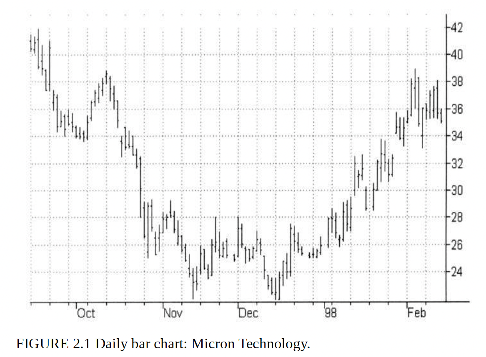

# Getting Started in Technical Analysis

## &#x20;Chapter 1: "Charts: Forecasting Tool or Folklore?"

**Overview**

Chapter 1 of "Getting Started in Technical Analysis" by Jack D. Schwager explores the debate over the efficacy of using charts in forecasting market movements. The chapter is presented in a debate format featuring two fictional characters: Faith N. Trend, a proponent of technical analysis, and Phillip A. Coin, a skeptic who subscribes to the Random Walk Theory.

**Key Points Discussed**

1. **Introduction to the Debate**:
   * The chapter opens with a debate on the usefulness of commodity price charts.
   * The question posed is <mark style="color:yellow;">whether charts can predict future market movements</mark> or if they are merely historical artifacts with no predictive power.
2. **The Skeptic's View**:
   * **Phillip A. Coin** argues that <mark style="color:blue;">market prices are random and unpredictable.</mark> He likens predicting market movements to predicting the sequence of colors on a roulette wheel.
   * Coin asserts that past prices do not influence future prices, thus charts only show historical data and cannot forecast future trends.
3. **The Proponent's View**:
   * **Faith N. Trend** counters that <mark style="color:red;">market prices, while influenced by numerous factors, are not entirely random</mark>. She emphasizes that prices reflect the collective behavior of market participants.
   * Trend argues that human behavior, which influences market prices, tends to follow certain patterns. Therefore, <mark style="color:red;">past price movements can provide insights into future market behavior</mark>.
4. **Potential Benefits of Charts**:
   * **Concise Price History**: Charts p<mark style="color:red;">rovide a clear and concise history of price movements,</mark> which is essential for any trader.
   * **Volatility Assessment**: Charts help traders <mark style="color:red;">gauge market volatility,</mark> which is crucial for risk assessment.
   * **Tool for Fundamental Analysts**: Even fundamental analysts can <mark style="color:red;">use charts to identify significant periods of price movements and correlate them with underlying conditions.</mark>
   * **Timing Tool**: Charts can assist in timing market entry and exit points.
   * **Money Management**: Charts help define realistic stop points for trades.
   * **Behavioral Patterns**: Charts can reveal repetitive behavioral patterns in the market, aiding in the anticipation of price moves.
   * **Prerequisite for Technical Systems**: Understanding chart concepts is essential for developing profitable technical trading systems.
   * **Contrarian Opportunities**: Under certain conditions, a contrarian approach to chart signals can be highly profitable.
5. **Criticism of Academic Studies**:
   * Coin cites academic studies that suggest technical rules do not outperform simple buy-and-hold strategies when transaction costs are considered.
   * Trend rebuts by stating that these studies often use oversimplified rules and do not disprove the potential effectiveness of more sophisticated chart analysis.
6. **Conclusion**:
   * The chapter suggests that while skepticism about the predictive power of charts is valid, dismissing them entirely overlooks their potential benefits.
   * It concludes that charts have various practical applications, from historical analysis to aiding in trading decisions, and that their value extends beyond simple price prediction.

Chapter 1 serves as an introduction to the fundamental concepts of technical analysis and sets the stage for a deeper exploration of charting techniques and their practical applications in subsequent chapters.

***

This summary captures the essence of the first chapter, which discusses the utility and skepticism surrounding chart analysis in trading. If you need further details or summaries of additional chapters, feel free to ask!

***

## Chapter 2&#x20;

covers various types of charts and how they are used in technical analysis. Here is a detailed summary of the key points:

#### Types of Charts

1. **Bar Charts**:
   * **Description**: Each trading day is represented as a vertical line (bar) ranging from the <mark style="color:red;">daily low to the daily high</mark>. The day’s closing value is indicated by a horizontal protrusion to the right of the bar, and sometimes the opening value by a protrusion to the left.
   * **Usage**: Commonly used because it provides a clear visualization of the daily range and closing price, which are critical for technical analysis.
   *

       <figure><figcaption></figcaption></figure>
2. **Close-Only Charts**:
   * **Description**: These charts f<mark style="color:red;">ocus solely on closing values</mark>, ignoring the highs and lows of the day. They are also known as line charts.
   * **Advantages**: Simplifies the visualization by focusing on the most crucial data point of the day—the closing price.
   * **Disadvantages**: Omits important data that could be useful for more detailed analysis. Some price series, like cash prices and spreads, are only available in close-only formats.
3. **Point-and-Figure Charts**:
   * **Description**: This chart type i<mark style="color:red;">gnores time and focuses solely on price movements. It consists of columns of X’s and O’s, where each X represents a price increase of a certain amount (box size)</mark> and each O represents a decrease.
   * **Advantages**: Excellent for identifying trends and price patterns without the noise of time.
   * **Disadvantages**: Can be more complex to create and interpret compared to bar and close-only charts.
   *

       <figure><figcaption></figcaption></figure>
4. **Candlestick Charts**:
   * **Description**: Adds dimension to bar charts by representing the <mark style="color:red;">range between the open and close as a "real body," which is shaded based on whether the stock closed higher or lower than it opened.</mark>
   * **Usage**: Highly valued for its visual appeal and the additional information it provides, such as patterns that indicate potential market reversals.
   *

       <figure><figcaption></figcaption></figure>

       <figure><figcaption></figcaption></figure>

#### Data Considerations

* **Nearest Futures**:
  * **Description**: Uses data from the nearest futures contract. This method can result in discontinuities due to the rollover from one contract to another.
  * **Usage**: Useful for short-term trading strategies but can complicate longer-term analysis.
  *

      <figure><figcaption></figcaption></figure>
* **Continuous Futures**:
  * **Description**: Adjusts for the rollover by creating a continuous series, which can be more useful for long-term analysis.
  * **Advantages**: Provides a smoother and more consistent data series for backtesting and historical analysis.
  * **Disadvantages**: May introduce its own set of biases due to the adjustments made.
* **Constant Forward (''Perpetual'') Series**:
  * **Description**: A continuous series that represents a theoretical constant forward contract.
  * **Usage**: Useful for certain types of analysis where continuous data is required, though it can be less intuitive than working with actual futures contracts.
* **Comparing the Series**:
  * **Importance**: Understanding the differences between these series is crucial for selecting the right one for your specific analytical needs. Each has its own set of strengths and weaknesses that can impact your trading decisions.

In summary, Chapter 2 provides a comprehensive overview of the different types of charts and data series used in technical analysis. Each type of chart has its own unique advantages and disadvantages, and the choice of which to use depends on the specific needs and preferences of the analyst. Understanding these tools is essential for effective technical analysis and informed trading decisions.

***

## Chapter 3: Trends

**1. Defining Trends by Highs and Lows**

* **Basic Goal:** The primary objective of chart analysis is to define and identify price trends, as trends provide the best profit opportunities.
* **Uptrend Definition:** An uptrend is characterised by a <mark style="color:red;">succession of higher highs and higher lows.</mark>
  * **Example:** In the example given (Figure 3.1), during March-September, each relative high (RH) is higher than the preceding high, and each relative low (RL) is higher than the preceding low.
  *

      <figure><figcaption></figcaption></figure>
  * **Trend Reversal Indicator:** A trend remains intact until a previous relative low point is broken, indicating a possible trend reversal. However, this is a clue, not absolute proof.
  * **Downtrend:** Similarly, a downtrend is defined by a series of lower highs and lower lows. a downtrend can be considered intact untill a previous relative high is exceded.
  * it is common for reactions against a major trend to begin near a line parallel to the trend line. aslo this might extend for manyh years.

**2. Trend Lines**

* trend lines and channels are useful but thier improtance is often overstated, it is easy to overestimate the reliability of trend lines when they are drawn with the benifit of hindsight.&#x20;
* Although the penetration of a trend line will sometime offer an early warning signal of a trend reversal, it is also common that such a development will merly require redrawing of the trend line
* a penetration of the trend line may not result in reversal but merly necessitated a redrawaing of the trend line
* **Defining Trend Lines:**
  * **Uptrend Line:** Connects a series of higher lows.
  * **Downtrend Line:** Connects a series of lower highs.
  * **Trend Channels:** Sets of parallel lines that enclose a trend, indicating major reactions against the trend often begin near these lines.
* **Rules for Trend Lines:**
  1. **Entry Points:** Declines approaching an uptrend line or rallies approaching a downtrend line are good opportunities to initiate positions in the direction of the major trend.
  2. **Penetration Signals:** Penetration of an uptrend line is a sell signal; penetration of a downtrend line is a buy signal. Confirmation usually requires a minimum percentage price move or a minimum number of closes beyond the trend line.
  3. **Profit-Taking Zones:** The lower end of a downtrend channel and the upper end of an uptrend channel are potential profit-taking zones for short-term traders.

**3. Drawing Trend Lines**

* **Significance:** The significance of a trend line increases with the number of highs or lows it connects.
* **Subjectivity:** The process is subjective, but there are objective methods like Thomas DeMark’s "TD lines" which connect the most recent relative lows (for uptrend lines) or highs (for downtrend lines).
  * **Revising Trend Lines:** As new relative highs and lows occur, trend lines are redefined, emphasizing the importance of recent prices over historical prices.

**4. Internal Trend Lines**

* **Concept:** Unlike conventional trend lines that encompass extreme highs and lows, internal trend lines may connect more frequent points within a price series, which can sometimes more accurately define the trend.

**5. Moving Averages**

* **Purpose:** Moving averages smooth a price series, making trends more discernible by removing short-term "noise."
  * **Simple Moving Average:** Calculated as the average close of the past N days.
  * **Other Variants:** Moving averages can be calculated using opens, highs, lows, or an average of these, and for time intervals other than daily.
  * **Directional Change:** A simple method to define trends is based on the direction of change in the moving average’s value relative to the previous day.
* **Length Impact:** The length of the moving average determines the degree of smoothing:
  * **Short-term Averages:** Provide less smoothing but are quicker to respond to price changes.
  * **Long-term Averages:** Provide more smoothing but are slower to respond to price changes.

Chapter 3 provides foundational knowledge for identifying, defining, and using trends in market analysis, emphasizing the importance of both subjective interpretation and objective methods in technical analysis .

***

## Chapter 4

focuses on "Trading Ranges and Support and Resistance." Here are the detailed notes from this chapter:

#### Trading Ranges: Trading Considerations

* **Definition**: A trading range is a horizontal corridor containing price fluctuations for an extended period.
* **Challenges**: Trading ranges are difficult to trade profitably; minimizing participation is often advised.
* **Methodologies**: Oscillators can be profitable in trading ranges but may be disastrous in trending markets.

#### Trading Range Breakouts

* **Breakout Significance**: A breakout suggests an impending price move in the breakout's direction.
* **Confirmation Factors**:
  * Sustained movement beyond the range for a number of days (e.g., five days).
  * Minimum percentage penetration or a given number of thrust days.

#### Support and Resistance

* **Trading Range Boundaries**:
  * Upper boundary typically acts as resistance.
  * Lower boundary typically acts as support.
* **Post-Breakout Behavior**:
  * After an upward breakout, the upper boundary becomes a support zone.
  * After a downward breakout, the lower boundary becomes a resistance zone.

#### Prior Major Highs and Lows

* **Behavioral Patterns**:
  * Resistance is encountered near previous major highs.
  * Support is found near previous major lows.

#### Concentrations of Relative Highs and Lows

* **Identification**: Significant clusters of highs and lows can indicate strong support or resistance levels.

#### Price Envelope Bands

* **Purpose**: To identify extreme price levels, typically used for setting buy or sell zones.

#### Practical Considerations

* **Trade Management**: Use stop-loss orders to manage risk in trading ranges.
* **Market Observation**: Historical data and chart patterns provide context for current price behavior.

#### Figures and Examples

* **Charts**:
  * **Figures 4.1 to 4.4**: Examples of multiyear trading ranges in stocks and indices.
  * **Figures 4.5 to 4.6**: Examples of breakouts from trading ranges.
  * **Figures 4.11 to 4.14**: Illustrations of support and resistance after breakouts.
  * **Figures 4.15 to 4.17**: Demonstrate the impact of prior major highs and lows on current prices.

This chapter emphasizes the importance of recognizing trading ranges and understanding how support and resistance levels are formed and transformed, providing essential tools for technical analysis and trading strategy development【28:0†source】【28:3†source】【28:4†source】【28:5†source】.

***

## &#x20;Chapter 5: Volume and Open Interest

**Importance of Volume and Open Interest**

* **Volume**: Refers to the number of shares or contracts traded in a given period.
  * **Indicates Strength**: High volume during price movements indicates strong conviction.
  * **Confirms Trends**: Volume can confirm trends; rising volume confirms an uptrend, while falling volume may signal weakness.
* **Open Interest**: Represents the total number of outstanding contracts that are held by market participants at the end of the day.
  * **Futures and Options**: Particularly relevant in futures and options markets.
  * **Market Sentiment**: Changes in open interest can provide insight into market sentiment and the strength of price trends.

**Volume Analysis**

* **Volume Patterns**:
  * **Volume Spikes**: Significant increases in volume often precede major price moves.
  * **Volume Dry-Ups**: Declines in volume can indicate the end of a trend or a period of consolidation.
* **On-Balance Volume (OBV)**: A technical analysis tool that accumulates volume based on whether prices close higher or lower.
  * **Calculation**: Adds volume on up days and subtracts volume on down days.
  * **Trend Confirmation**: Used to confirm price trends and spot potential reversals.
* **Volume Moving Averages**: Smooth out volume data to identify trends.
  * **Short-Term vs. Long-Term**: Short-term moving averages are more responsive to recent changes, while long-term moving averages provide a broader view.

**Open Interest Analysis**

* **Open Interest Patterns**:
  * **Rising Open Interest**: Indicates new money entering the market, confirming existing trends.
  * **Falling Open Interest**: Suggests positions are being closed, potentially signaling a trend reversal.
* **Open Interest and Market Direction**:
  * **Bullish Indicators**: Rising prices and rising open interest typically indicate a bullish market.
  * **Bearish Indicators**: Falling prices and rising open interest suggest a bearish market.
* **Combining Volume and Open Interest**:
  * **Trend Strength**: Strong trends are usually accompanied by both increasing volume and open interest.
  * **Weak Trends**: Declining volume or open interest during price movements can indicate weakening trends.

**Practical Applications**

* **Volume and Price Reversals**:
  * **Climactic Volume**: Extremely high volume after a prolonged trend may indicate a reversal.
  * **Volume Precedes Price**: Changes in volume often lead changes in price.
* **Volume and Trend Continuation**:
  * **Rising Volume**: Confirms trend continuation.
  * **Divergence**: When price moves without corresponding volume changes, it may indicate an impending reversal.
* **Using Volume and Open Interest in Trading**:
  * **Entry and Exit Points**: Volume and open interest can help identify optimal entry and exit points.
  * **Risk Management**: Analyzing volume and open interest can aid in assessing the risk and strength of positions.

#### Key Takeaways

* Volume and open interest are crucial components of technical analysis that provide insights into market strength and sentiment.
* Proper analysis of volume and open interest can confirm trends, signal reversals, and enhance trading strategies.
* Combining volume and open interest with other technical indicators can improve the accuracy and effectiveness of market analysis.

## Chapter 6: Oscillators

**Overview** Chapter 6 delves into oscillators, a type of technical indicator widely used in trading to evaluate price activity and make trading decisions. Oscillators are especially popular among traders for identifying potential price reversals.

**Key Concepts**

1. **Oscillators and Momentum**
   * **Definition**: Oscillators are mathematical formulas that measure the rate at which prices change, referred to as momentum.
   * **Significance of Momentum**:
     * Healthy price trends exhibit strong momentum.
     * Weakening momentum can indicate a potential trend reversal or correction.
   * **Example**: A stock that progressively increases in value shows increasing momentum.
2. **Basic Oscillators**
   * **Momentum Calculation**:
     * Momentum can be calculated by subtracting the price of N days ago from today's price.
     * Example: 10-day momentum = today's closing price - closing price 10 days ago.
   * **Rate of Change (ROC)**:
     * Another form of momentum indicator calculated as today's price divided by the price N days ago.
     * Both momentum and ROC have an equilibrium line (zero line) indicating whether prices are higher or lower than N days ago.
3. **Overbought, Oversold, and Divergence**
   * **Overbought and Oversold Levels**:
     * Extreme indicator readings can suggest overbought (above equilibrium) or oversold (below equilibrium) conditions.
   * **Divergence**:
     * Occurs when the price moves in the opposite direction to the oscillator, potentially signaling a reversal.
4. **Common Oscillators**
   * **Relative Strength Index (RSI)**:
     * Measures the speed and change of price movements.
     * Values range from 0 to 100; typically, a level above 70 indicates overbought conditions, and below 30 indicates oversold conditions.
   * **Stochastics**:
     * Compares a particular closing price to a range of prices over a certain period.
     * Often used to identify overbought and oversold conditions.
   * **Moving Average Convergence-Divergence (MACD)**:
     * Shows the relationship between two moving averages of a security's price.
     * Signals potential buy and sell points.
   * **Other Oscillators**:
     * Momentum, Rate of Change (ROC), etc., each with unique calculations and uses.
5. **Using Oscillators in Trading**
   * **Countertrend Indicators**:
     * Oscillators are often used to identify shorter-term price reversal points, appealing to traders' contrarian inclinations.
   * **Sensitivity of Oscillators**:
     * The number of days used in the calculation determines the sensitivity of the oscillator.
     * Shorter periods make the oscillator more sensitive to price changes, while longer periods smooth out the fluctuations.

**Figures and Illustrations**

* The chapter includes various figures that illustrate the application of oscillators such as RSI, Stochastics, and MACD on different stock charts, demonstrating how these tools help in identifying overbought and oversold conditions, as well as potential reversal points.

This chapter provides a comprehensive understanding of oscillators, their calculation, significance, and application in trading, making it a vital tool for technical analysts .

## Chapter 7: Is Chart Analysis Still Valid?

**Overview**

Chapter 7 of "Getting Started in Technical Analysis" by Jack D. Schwager discusses the validity and effectiveness of chart analysis in trading. Despite skepticism from some traders, chart analysis remains a powerful tool for market prediction and decision-making.

**Key Points**

1. **Skepticism Towards Chart Analysis**
   * Many traders question the validity of chart analysis.
   * Common objections include:
     * Its simplicity.
     * The possibility of floor traders manipulating markets to trigger chart stops.
     * The method being too publicized to remain effective.
2. **Factors Supporting Chart Analysis**
   * **Risk Control**: Success in trading does not depend on being right more than half the time but on controlling losses and allowing profitable trades to run.
   * **Price Reflection**: Chart patterns reflect the collective behavior and psychology of market participants.
   * **Adaptability**: Chart analysis adapts to changing market conditions as it is based on price movements.
   * **Historical Evidence**: Historical data shows recurring patterns that can be used for future predictions.
3. **Common Misconceptions**
   * **Market Efficiency**: Critics argue that efficient markets render chart analysis useless, but the presence of human behavior introduces inefficiencies that charts can exploit.
   * **Fundamentals vs. Technicals**: Both fundamental and technical analyses have their place in trading, and successful traders often use a combination of both.
4. **Effectiveness of Chart Analysis**
   * Despite increased awareness, chart analysis continues to work because:
     * Not all market participants use it.
     * Markets are driven by psychology, which remains constant.
     * Chart analysis helps in identifying key levels of support and resistance, trends, and potential reversal points.
5. **Practical Applications**
   * **Trend Identification**: Charts help in identifying the direction and strength of trends.
   * **Entry and Exit Points**: They provide signals for when to enter or exit trades.
   * **Risk Management**: Charts assist in setting stop-loss points and managing risk effectively.
6. **Conclusion**
   * Chart analysis is a valuable tool for traders when used correctly.
   * It should be combined with other forms of analysis and a disciplined approach to trading.

#### Key Takeaways

* Chart analysis remains a valid and effective method for trading.
* Its simplicity is its strength, reflecting the underlying psychology of market participants.
* Effective risk control and historical pattern recognition are crucial to its success.
* Combining chart analysis with other trading strategies enhances its effectiveness.

By understanding and applying the principles of chart analysis, traders can gain insights into market movements and improve their trading outcomes.

***

## Chapter 8: Midtrend Entry and Pyramiding

**Introduction**

Chapter 8 of "Getting Started in Technical Analysis" by Jack D. Schwager delves into strategies for entering trades midtrend and effectively pyramiding positions. It emphasizes the importance of these techniques for maximizing profits during significant market moves.

**Midtrend Entry**

* **Midtrend Entry Definition**: The process of entering a trade after a trend has already been established, rather than at the beginning.
* **Challenges**: The primary challenge is the increased risk of reversals after a significant portion of the trend has already occurred.
* **Strategies for Midtrend Entry**:
  * **Breakout Strategies**: Entering trades on breakouts from consolidation patterns within an existing trend.
  * **Retracement Strategies**: Entering trades on pullbacks or retracements within a trend, often using Fibonacci retracement levels as entry points.
  * **Indicator-based Strategies**: Utilizing oscillators or moving averages to identify opportune moments for entering a trend that is already in progress.

**Pyramiding**

* **Definition**: Adding new positions to an already profitable trade to increase exposure to a favorable trend.
* **Rationale**: Pyramiding allows traders to maximize profits from major trends while managing risk through staged entries.
* **Guidelines for Pyramiding**:
  1. **Profitability**: Only add to positions that are already showing a profit.
  2. **Stop Points**: Do not add to a position if the new stop point would result in a net loss for the entire position.
  3. **Position Size**: The size of pyramid units should be no greater than the base (initial) position size.
  4. **Timing**: Add positions at logical points such as breakouts or key support/resistance levels within the trend.

**Example of a Pyramiding Strategy**

* **Step-by-Step Approach**:
  1. **Identify a Reaction**: Define a reaction in an uptrend when the market closes below the prior 10-day low.
  2. **Additional Position**: Initiate an additional long position on a subsequent 10-day high if the pyramid signal price is above the price at which the most recent long position was initiated and if the net position size is less than three units.
  3. **Exit Rules**: Liquidate all pyramid positions if an opposite trend-following signal is received or if the overall market conditions change unfavorably.

**Risk Control**

* **Importance of Risk Management**: Risk control is crucial when adding positions through pyramiding to prevent significant losses.
* **Stop Rules**: Employ more sensitive conditions for liquidating pyramid positions than for initiating them to limit potential losses.
* **Dynamic Position Sizing**: Adjust position sizes dynamically based on market conditions and the strength of the trend.

**Practical Application**

* **Real-world Application**: The chapter provides real-world examples and case studies to illustrate the effective implementation of midtrend entry and pyramiding strategies.
* **Performance Optimization**: Emphasizes testing and optimizing these strategies to ensure they are robust and perform well under various market conditions.

**Conclusion**

Chapter 8 highlights the significance of midtrend entry and pyramiding as advanced trading techniques that, when used correctly, can greatly enhance profitability. The chapter provides practical guidelines and detailed strategies for traders to effectively implement these techniques while managing risk.

***

## Chapter 9: Choosing Stop-Loss Points

**Importance of Stop-Loss Points**

* **Objective**: The primary goal is to limit losses on trades by determining a precise exit point before entering the trade.
* **Discipline**: A predetermined exit strategy prevents procrastination and emotional decision-making during adverse market movements.
* **GTC Orders**: Ideally, a good-till-canceled (GTC) stop order should be placed at the same time the trade is initiated.

**Determining Stop-Loss Points**

* **Key Principle**: Liquidate the position before the price movement causes a significant transition in the technical picture.
* **Technical Reference Points**:
  1. **Trend Lines**:
     * Place sell stops below uptrend lines and buy stops above downtrend lines.
     * Pros: Trend line penetrations provide early signals of trend reversals.
     * Cons: Susceptible to false signals; trend lines may need redefinition during prolonged trends.
  2. **Trading Ranges**:
     * Use the opposite side of the trading range as a stop point.
     * Stops can be placed closer within broader ranges, somewhere between the midpoint and the distant boundary.
  3. **Chart Patterns**:
     * Utilize patterns like head-and-shoulders, triangles, or flags for determining stop points.
     * Example: In head-and-shoulders, place the stop just beyond the neckline.
  4. **Previous Highs and Lows**:
     * Stop points can be set just beyond recent significant highs or lows.
  5. **Moving Averages**:
     * Employ moving averages as dynamic support/resistance levels for placing stops.

**Flexibility in Stop Placement**

* **Mental Stops**: Traders confident in their discipline may use mental stops and place orders within the permissible daily range.
* **Dynamic Adjustments**: Stops may be adjusted based on market volatility and the evolving technical picture.

**Diversification and Stop-Loss Points**

* **Diversification**: Trading across multiple markets can reduce risk, as adverse moves are unlikely to be synchronized.
* **Example**: A trader with $20,000 may trade one contract each of gold and soybeans instead of two contracts of a single market, potentially reducing drawdowns.

**Stop-Loss Strategy for System Traders**

* **System-Based Reversals**: Some trading systems inherently control risk by reversing positions during significant trend reversals, thus performing the major function of a stop-loss rule without explicitly using one.

**Conclusion**

* **Effective Loss Control**: Successful chart-oriented trading heavily depends on the effective control of losses through well-placed stop-loss points.
* **Proactive Planning**: Always determine a stop-loss point in advance to maintain trading discipline and avoid catastrophic losses.

***

## Chapter 10: Setting Objectives and Other Position Exit Criteria

**Introduction**

* **Quote by Edwin Lefèvre**: Emphasizes the importance of "sitting tight" in the market, highlighting that patience often yields significant profits, rather than constant trading.

**Challenges in Exiting Trades**

* **Getting Out**: Exiting a trade, especially a profitable one, is more challenging than entering. While losing trades can be cut short with predetermined stops, profitable trades require a strategic exit plan to maximize gains.

**Chart-Based Objectives**

* **Measured Move**:
  * A technique that projects the potential price move of a security based on its previous movement.
  * The measured move concept involves taking the height of a price pattern (like a head and shoulders or a double top/bottom) and projecting that height from the breakout point.
* **Support and Resistance Levels**:
  * Exiting at key support or resistance levels can be an effective strategy.
  * Traders might set profit targets at these levels, where price movements tend to pause or reverse.

**Overbought/Oversold Indicators**

* **Indicators**:
  * Used to identify extreme market conditions where a security is considered overbought or oversold.
  * Common indicators include the Relative Strength Index (RSI) and Stochastic Oscillator.
* **Strategy**:
  * Traders can use these indicators to signal potential exit points.
  * For instance, selling when an overbought condition is detected and buying back when the market becomes oversold.

**Contrary Opinion**

* **Contrarian Strategy**:
  * This strategy involves taking a position opposite to the prevailing market sentiment.
  * Tools like sentiment surveys or put/call ratios can help gauge market sentiment.
* **Application**:
  * If the majority of market participants are extremely bullish, a contrarian trader might consider it a signal to exit long positions.

**Trailing Stops**

* **Dynamic Stop-Loss**:
  * Trailing stops are adjusted as the market price moves in favor of the trade, locking in profits while allowing the position to remain open.
  * This method is beneficial as it provides a safety net to protect gains without needing to predict exact market tops or bottoms.

**Change of Market Opinion**

* **Reassessment**:
  * Traders should be flexible and willing to change their market opinion based on new information or changes in market conditions.
  * This might involve reversing a position if indicators suggest a significant shift in the market trend.

#### Summary

Chapter 10 covers various strategies for exiting positions effectively to maximize profits and minimize losses. Key techniques include using chart patterns for measured moves, leveraging support and resistance levels, applying overbought/oversold indicators, adopting a contrarian approach, implementing trailing stops, and being flexible with changing market opinions. These strategies help traders make informed decisions about when to exit trades, addressing the complexity of managing profitable trades compared to straightforward stop-loss exits for losing trades.

***

#### Detailed Notes of Chapter 11: The Most Important Rule in Chart Analysis

**Overview**

Chapter 11 focuses on the concept of failed signals in chart analysis, emphasizing their reliability and the significant insights they provide for predicting market reversals. This chapter outlines various types of failed signals, how to recognize them, and their implications for trading strategies.

**Key Points**

1. **Failed Signals: Definition and Importance**
   * A failed signal occurs when the market does not follow through in the direction indicated by a chart signal, suggesting a potential move in the opposite direction.
   * These signals are among the most reliable in chart analysis, providing crucial information often overlooked by novice chartists.
2. **Bull and Bear Traps**
   * A bull trap happens when prices break out above a resistance level but then quickly reverse, indicating a false bullish signal.
   * A bear trap is the opposite, where prices break below a support level but then rebound, indicating a false bearish signal.
   * Both traps suggest a weak underlying market and often lead to significant moves in the opposite direction.
3. **False Trend Line Breakouts**
   * When a market breaks a trend line but fails to maintain the breakout, it often reverses direction.
   * This false breakout indicates that the trend line remains intact and the market may continue in the original direction.
4. **Filled Gaps**
   * Gaps in price charts that are subsequently filled (i.e., the price returns to the pre-gap level) suggest a false signal.
   * Filled gaps often indicate a continuation of the previous trend rather than the start of a new trend.
5. **Return to Spike Extremes**
   * Spikes are sharp, one-day price movements. If the price returns to the extreme of the spike, it signals a potential reversal.
   * This pattern suggests that the spike was a false move, and the market may move significantly in the opposite direction.
6. **Return to Wide-Ranging Day Extremes**
   * Similar to spikes, wide-ranging days show substantial price movement within a single trading session.
   * If the market returns to the extreme of a wide-ranging day, it often signals a reversal of the initial move.
7. **Counter-to-Anticipated Breakout of Flag or Pennant**
   * Flags and pennants are continuation patterns. If the breakout occurs in the opposite direction of the anticipated move, it suggests a strong reversal.
   * This pattern often indicates that the initial trend has lost momentum, and the market may move significantly in the opposite direction.
8. **Opposite Direction Breakout of Flag or Pennant Following a Normal Breakout**
   * If the market initially breaks out in the anticipated direction but then reverses and breaks out in the opposite direction, it signals a strong reversal.
   * This pattern indicates a failed continuation signal, suggesting a significant move in the opposite direction.
9. **Penetration of Top and Bottom Formations**
   * When top or bottom formations, such as head and shoulders or double tops/bottoms, are penetrated but fail to hold, it signals a false breakout.
   * This pattern often leads to a significant move in the opposite direction of the initial breakout.
10. **Breaking of Curvature**
    * Curved patterns, such as rounding tops or bottoms, if broken but the market fails to sustain the move, indicate a false signal.
    * This suggests a potential reversal, with the market moving significantly in the opposite direction.
11. **The Future Reliability of Failed Signals**
    * Failed signals are not only reliable for the immediate reversal but also provide insights into the future market direction.
    * Recognizing and acting on failed signals enhances trading effectiveness by aligning trades with the true market sentiment.

**Conclusion**

Chapter 11 underscores the importance of failed signals in chart analysis. Recognizing and correctly interpreting these signals can significantly improve trading outcomes by identifying false moves and anticipating significant reversals. This chapter provides traders with practical tools to refine their strategies and enhance their understanding of market dynamics​​ .

## Chapter 12: Real-World Chart Analysis

Chapter 12 of "Getting Started in Technical Analysis" by Jack D. Schwager delves into practical applications of chart analysis in real-world trading scenarios. The chapter emphasizes the importance of moving beyond theoretical knowledge to applying technical analysis in live market conditions. Below are detailed notes covering the key points and examples provided in this chapter.

**Introduction to Real-World Chart Analysis**

* **Key Concept**: Trading success is often hindered by human emotions such as hope and fear. Successful traders must learn to manage these emotions, fearing that losses may grow and hoping that profits may increase.
* **Practicality**: The chapter presents real-world trade examples, illustrating both successful and unsuccessful trades, to demonstrate how theoretical knowledge is applied in practice.

**Methodology for Using This Chapter**

* **Active Participation**: Readers are encouraged to actively engage with the charts provided, analyzing them before revealing the trade outcomes and Schwager’s analysis.
* **Step-by-Step Analysis**: For each trade example, Schwager details the reasons for entry and exit, followed by a commentary on the trade's performance and lessons learned.

**Trade Examples and Analysis**

1. **December 1993 T-Bond**:
   * **Trade Entry Reasons**:
     1. Breakout above triangular consolidation suggested a continuation of the bullish trend.
     2. Pullback to major support level reinforced by an internal trend line and the top of the triangle.
   * **Trade Exit**: Downside penetration of the lower end of the triangle invalidated the trade signal.
   * **Commentary**: Trades should be liquidated once the primary premise for the trade is violated.
2. **Further Examples**:
   * **Approach**: Each chart is analyzed using a similar format: identifying trade entry reasons, determining exit points, and providing commentary on the trade's performance.
   * **Learning from Losses**: Schwager includes both winning and losing trades, emphasizing the importance of understanding what can go wrong.

**Key Takeaways**

* **Discipline and Flexibility**: Successful trading requires the discipline to adhere to predefined strategies and the flexibility to adapt when signals fail.
* **Importance of Failed Signals**: Recognizing and acting upon failed signals is crucial. This involves reversing positions if market behavior indicates a shift.
* **Application of Multiple Techniques**: The chapter showcases various technical tools and methods, encouraging readers to find the mix that works best for them.
* **Real-World Relevance**: By presenting actual trade recommendations and outcomes, Schwager bridges the gap between theoretical analysis and practical trading.

**Conclusion**

* **Holistic Perspective**: The chapter provides a rounded perspective by including a variety of trade examples, demonstrating the application of technical analysis in different market scenarios.
* **Continuous Learning**: The inclusion of both successful and unsuccessful trades highlights the ongoing learning process inherent in trading.

This chapter is pivotal in Schwager’s book as it transitions from the foundational principles and tools of technical analysis to their application in real-world trading, offering invaluable insights into the practical challenges and considerations traders face.

***

## Chapter 13: Charting and Analysis Software

**Overview**

Chapter 13 of "Getting Started in Technical Analysis" focuses on the significant role of charting and analysis software in technical analysis. This chapter discusses the considerations for selecting software, the types of software available, and the importance of quality price data.

**Importance of Charting and Analysis Software**

* The advent of powerful computers and software has revolutionized technical analysis.
* Modern software liberates traders from manual charting, allowing for sophisticated analysis and testing of trading ideas.
* Such tools are essential for serious traders and technical analysts.

**Types of Software**

* Numerous software packages cater to different needs and markets, from general technical analysis to specialized applications like Elliott Wave analysis or mutual fund data.
* The chapter primarily focuses on broader-based programs that offer a variety of analytical tools and trading system testing capabilities.

**Price Data Considerations**

* The type of analysis and trading influences the choice of price data and, subsequently, the software used.
* Quality price data is crucial for effective technical analysis.

**Software Selection Criteria**

1. **Features and Capabilities**
   * Ability to load and manipulate price data.
   * Variety of chart types: bar, point-and-figure, close-only, candlestick, and more.
   * Range of time frames: daily, weekly, monthly, hourly, etc.
   * Analytical tools and indicators: moving averages, oscillators, trend lines, etc.
   * System testing capabilities for designing and evaluating trading strategies.
2. **User Interface and Usability**
   * Intuitive and user-friendly interfaces are preferred, especially for beginners.
   * More advanced programs may require some programming knowledge, particularly those with system testing functionalities.
3. **Compatibility and Integration**
   * Ensure compatibility with the types of data the trader wishes to analyze.
   * Ability to integrate with data feeds and other tools.
4. **Support and Resources**
   * Availability of customer support, tutorials, and community forums.
   * Access to regular updates and improvements.

**Computer Skills and Requirements**

* Basic technical analysis software is designed to be user-friendly, allowing traders to perform charting and analysis without advanced computer skills.
* More sophisticated software, particularly those for system testing, may require some programming knowledge.

**Analytical Programs vs. Trading Programs**

* **Analytical Programs:** Allow users to conduct their analysis based on personal insights and data.
* **Trading Programs:** Provide pre-packaged trading systems with buy and sell recommendations.
* Some programs offer a combination of both analytical and trading system capabilities.

**Mid-Level Technical Analysis Program Features**

* Download historical and end-of-day prices for various markets (stocks, futures, mutual funds, options).
* Create different types of charts in multiple time frames.
* Perform chart analysis and apply a variety of technical indicators, with customizable parameters.

#### Summary

Chapter 13 emphasizes the transformative impact of charting and analysis software on technical analysis. It provides insights into the selection criteria for these tools, the types of available software, and the importance of integrating high-quality price data. This chapter serves as a guide for traders to navigate the complexities of choosing the right software to enhance their technical analysis capabilities.

 

***

## Chapter 14: Technical Trading Systems: Structure and Design

**What This Book Will and Will Not Tell You about Trading Systems**

* The chapter does not offer secret or guaranteed trading systems but provides the background knowledge to develop personalized trading systems.
* The primary goals include understanding basic trend-following systems, identifying their weaknesses, transforming generic systems into more powerful ones, exploring countertrend systems, and leveraging diversification to improve performance.

**The Benefits of a Mechanical Trading System**

* **Emotion Elimination**: Mechanical systems remove emotional influences, helping avoid common trading errors such as overtrading, premature liquidation, and holding onto losing positions.
* **Consistency**: Ensures a consistent approach by following all signals from a common set of conditions, crucial for long-term profitability.
* **Risk Control**: Provides methods for controlling risk, including stop-loss rules and conditions for trade exits, preventing catastrophic losses.

**Three Basic Types of Systems**

1. **Trend-Following Systems**: Aim to capture profits by identifying and following market trends.
2. **Moving Average Systems**: Utilize moving averages to generate buy and sell signals based on the crossing of average prices.
3. **Breakout Systems**: Focus on identifying and trading breakouts from established price ranges or patterns.

**Ten Common Problems with Standard Trend-Following Systems**

1. **Too Many Similar Systems**: Construct original systems to avoid trading with the crowd.
2. **Whipsaws**: Use confirmation conditions, filter rules, and diversification.
3. **Failure to Exploit Major Price Moves**: Add a pyramiding component.
4. **Surrendering Large Percentages of Profits**: Implement trade exit rules.
5. **Inability to Profit in Trading Range Markets**: Combine trend-following with countertrend systems.
6. **Temporary Large Losses**: Trade multiple systems in each market, and trade lightly if entering positions after signals.
7. **Extreme Volatility**: Employ diversification to balance risk and profit potential.
8. **Systems that Fail After Testing**: Properly test systems to ensure reliability.
9. **Parameter Shifts**: Diversify by trading variations of each system and use market characteristic adjustments.
10. **Slippage**: Use realistic assumptions for trading.

**Countertrend Systems**

* **Appeal**: Countertrend systems are designed to profit from market reversals, typically when trends are exhausted or overextended.
* **Characteristics**: Often involve strategies like buying dips in an uptrend or selling rallies in a downtrend.
* **Types**: Include various methodologies that capitalize on price corrections against the prevailing trend.

**Diversification**

* **Importance**: Spread trading across a broad range of markets to reduce risk and improve overall performance.
* **Implementation**: Diversification can be within a single market or across different markets, strategies, and asset classes to achieve a balanced risk profile.

**Conclusion**

Chapter 14 emphasizes the importance of understanding the structure and design of technical trading systems, highlighting the benefits of mechanical systems, addressing common problems with trend-following systems, and promoting diversification and countertrend strategies as essential components for successful trading.

These detailed notes encapsulate the core concepts and practical guidelines discussed in Chapter 14, providing a comprehensive overview for anyone looking to enhance their trading systems and strategies.

 

***

## Chapter 15: Testing and Optimizing Trading Systems

**Overview**

Chapter 15 of "Getting Started in Technical Analysis" delves into the complexities of testing and optimizing trading systems. This chapter provides essential guidance on how to evaluate and refine trading systems to enhance their effectiveness in real-world trading scenarios.

**Key Concepts**

1. **The Well-Chosen Example**
   * Emphasizes the importance of using realistic examples to illustrate the testing and optimization process.
   * Highlights the pitfalls of relying on past performance to predict future success.
2. **Basic Concepts and Definitions**
   * Introduces fundamental terms and concepts critical to understanding system testing, such as optimization, backtesting, and parameter fitting.
3. **Choosing the Price Series**
   * Discusses the importance of selecting appropriate price data for testing.
   * Advises on considering different market conditions and time frames to ensure robust testing.
4. **Choosing the Time Period**
   * Recommends selecting diverse time periods for testing to avoid overfitting and ensure the system performs well across different market environments.
   * Suggests dividing data into in-sample (for optimization) and out-of-sample (for testing) periods.
5. **Realistic Assumptions**
   * Stresses the necessity of incorporating realistic assumptions about slippage, transaction costs, and market impact.
   * Warns against overly optimistic assumptions that can skew test results.
6. **Optimizing Systems**
   * Explains the process of optimization, which involves finding the best set of parameters for a trading system.
   * Cautions against over-optimization, which can lead to a system that performs well on historical data but poorly in real markets.
7. **Testing Versus Fitting**
   * Differentiates between genuine system testing and mere fitting of the system to historical data.
   * Advocates for blind simulation as a method to avoid fitting errors.
8. **Blind Simulation**
   * Describes a method of testing where data is split into multiple periods, ensuring that the system is tested on data that was not used during optimization.
   * This approach mimics real-life trading decisions based on past data.
9. **Average Parameter Set Performance**
   * Suggests evaluating the system's performance across a range of parameter sets rather than relying on the best-performing set.
   * Helps to understand the system's robustness and potential performance in different market conditions.

**The Truth about Simulated Results**

* **Multimarket System Testing**
  * Advocates for testing the system across multiple markets to assess its versatility and robustness.
  * Helps in identifying market-specific adjustments required for the system.
* **Negative Results**
  * Acknowledges that not all tests will yield positive results.
  * Emphasizes learning from negative results to improve the system.

**Steps in Constructing and Testing a Trading System**

1. **Define Trading Rules**
   * Clearly outline the rules for entering and exiting trades.
2. **Choose Markets**
   * Select appropriate markets for trading based on the system’s design and objectives.
3. **Conduct Preliminary Tests**
   * Perform initial tests to identify any obvious flaws or adjustments needed in the system.
4. **Optimize Parameters**
   * Fine-tune the system's parameters to enhance performance without overfitting.
5. **Validate with Out-of-Sample Data**
   * Test the system on data that was not used during the optimization phase to validate its effectiveness.
6. **Simulate Real-Time Trading**
   * Mimic real-time trading to assess the system's performance under live market conditions.

**A Note on System Testing Software**

* **Software Tools**
  * Discusses the importance of using reliable and comprehensive software tools for system testing and optimization.
  * Highlights features to look for in testing software, such as robustness, flexibility, and ease of use.

**Observations about Trading Systems**

* **Continuous Improvement**
  * Emphasizes the need for continuous monitoring and improvement of trading systems.
  * Stresses the importance of adapting to changing market conditions and evolving trading strategies accordingly.

#### Conclusion

Chapter 15 provides a comprehensive guide to testing and optimizing trading systems. It underscores the importance of realistic testing, avoiding overfitting, and continuously refining systems to adapt to market changes. By following the outlined steps and considerations, traders can develop robust systems capable of performing well in various market conditions.

 

***

#### Chapter 16: "The Planned Trading Approach"

Chapter 16 of "Getting Started in Technical Analysis" by Jack D. Schwager provides a comprehensive guide on constructing a systematic trading plan. The chapter outlines seven essential steps for developing an organized trading approach, emphasizing the importance of discipline and strategic planning in achieving trading success. Here are the detailed notes for each step:

**Step One: Define a Trading Philosophy**

* **Core Decision-Making Approach**: Traders must establish a clear methodology for making trading decisions. This could involve technical analysis, fundamental analysis, or a combination of both. The philosophy should be detailed and structured, avoiding vague strategies based on external tips or instinct.
* **Consistency and Discipline**: A well-defined philosophy helps in maintaining consistency and discipline, which are crucial for long-term success.

**Step Two: Choose Markets to Be Traded**

* **Suitability to Trading Approach**: Select markets that align with the chosen trading philosophy. Different markets may be better suited for various strategies.
* **Diversification**: It’s important to diversify across different markets to spread risk.
* **Volatility Considerations**: Understand the volatility of the chosen markets as it impacts risk and strategy execution.

**Step Three: Specify Risk Control Plan**

* **Maximum Risk Per Trade**: Determine the maximum percentage of capital to risk on any single trade to protect against significant losses.
* **Stop-Loss Strategy**: Implement a stop-loss strategy to limit potential losses on each trade.
* **Diversification**: Reinforce the need for diversification within the risk control plan to minimize exposure.
* **Leverage Management**: Adjust leverage according to market correlations and equity changes to manage risk effectively.
* **Adjustments During Losing Periods**: Discretionary traders should adapt their risk approach during periods of losses to protect capital.

**Step Four: Establish a Planning Time Routine**

* **Daily Review**: Allocate time each evening for reviewing market conditions and updating trading strategies. This routine should include:
  * **Updating Systems and Charts**: Ensure trading systems and charts are current to aid decision-making.
  * **Planning New Trades**: Identify potential new trades and develop specific entry plans.
  * **Updating Exit Points**: Regularly review and adjust stop-loss levels and profit targets based on market developments.

**Step Five: Maintain a Trader's Notebook**

* **Record Keeping**: Systematic record-keeping is essential. The trader’s notebook should detail all trade-related decisions, including entry and exit points, rationale, and outcome analysis.
* **Format Example**: Figure 16.1 in the book provides a sample format for maintaining a trader's notebook, helping traders organize and review their strategies and performance.

**Step Six: Maintain a Trader's Diary**

* **Personal Trading Journal**: Keep a diary to record thoughts, feelings, and observations about trading activities. This diary helps in understanding the psychological aspects of trading and identifying patterns that affect performance.

**Step Seven: Analyze Personal Trading**

* **Segmentation and Analysis**: Regularly analyze trades by segmenting them based on different criteria (e.g., market type, strategy used). This helps in identifying strengths and weaknesses in the trading approach.
* **Equity Charting**: Use equity charts to visualize trading performance over time, aiding in performance assessment and strategy refinement.

#### Conclusion

The chapter emphasizes the necessity of a structured trading approach. By following these steps, traders can enhance their decision-making process, manage risks effectively, and ultimately improve their chances of success in the markets.

These steps are not just theoretical guidelines but are practical actions that can lead to more disciplined and potentially more profitable trading.

 

***

#### Chapter 17: Eighty-Two Trading Rules and Market Observations

**Chapter 17** of "Getting Started in Technical Analysis" by Jack D. Schwager presents a collection of 82 trading rules and market observations, offering insights into successful trading practices. Here is a detailed summary of these rules and observations:

1. **Cut Your Losses Short**: The most important rule in trading. Traders must always be ready to exit a losing position before it becomes disastrous.
2. **Always Use Stop-Loss Orders**: Implementing stop-loss orders ensures that traders limit their losses and protect their capital.
3. **Don't Overtrade**: Overtrading can lead to increased transaction costs and poor decision-making.
4. **Trade With the Trend**: Trading in the direction of the prevailing market trend increases the probability of success.
5. **Let Profits Run**: Allow profitable trades to continue as long as the market trend supports them.
6. **Avoid Holding Positions Over Earnings Announcements**: This reduces the risk of unexpected price movements due to earnings surprises.
7. **Don’t Fight the Market**: Respect the market’s power and avoid trying to impose your will on it.
8. **Avoid Catching Falling Knives**: Don’t attempt to buy into a sharply falling market without a clear sign of reversal.
9. **Use a Trading Plan**: Have a well-defined trading plan that outlines entry and exit points, position size, and risk management.
10. **Trade Only Liquid Markets**: Focus on markets with high liquidity to ensure smooth entry and exit of positions.
11. **Be Patient**: Wait for the right trading opportunities rather than forcing trades.
12. **Diversify**: Spread risk across different markets and instruments.
13. **Don't Trade Based on Tips**: Make trading decisions based on analysis, not on rumors or tips from others.
14. **Control Your Emotions**: Keep emotions in check to avoid impulsive decisions.
15. **Keep Detailed Records**: Maintain comprehensive records of all trades to analyze performance and learn from mistakes.
16. **Review Trades Regularly**: Regularly review past trades to identify strengths and weaknesses in your trading strategy.
17. **Focus on Risk/Reward Ratio**: Aim for trades where the potential reward outweighs the risk.
18. **Avoid Illiquid Markets**: Trading in illiquid markets can lead to large bid-ask spreads and slippage.
19. **Don't Add to Losing Positions**: Avoid increasing your exposure in a losing trade.
20. **Stay Informed**: Keep up to date with market news and developments that can impact your trading.
21. **Learn Continuously**: Trading is an ever-evolving field, so continuous learning and adaptation are essential.
22. **Don't Predict Tops or Bottoms**: Focus on identifying trends and trading them rather than trying to pick exact turning points.
23. **Avoid Leverage**: Excessive leverage can amplify losses and lead to rapid account depletion.
24. **Be Flexible**: Adapt to changing market conditions and be willing to revise your trading strategy as needed.
25. **Use Technical Analysis**: Incorporate technical analysis tools to help identify trading opportunities.
26. **Avoid Herd Mentality**: Make independent trading decisions based on analysis rather than following the crowd.
27. **Risk Only What You Can Afford to Lose**: Never risk more capital than you can afford to lose.
28. **Trade With Discipline**: Stick to your trading plan and avoid making impulsive decisions.
29. **Take Breaks**: Avoid burnout by taking regular breaks and not constantly monitoring the markets.
30. **Know When to Walk Away**: Recognize when it’s time to exit a trade or take a break from trading altogether.

The remaining rules expand on these principles, emphasizing the importance of discipline, risk management, and continuous learning in trading. Schwager’s observations highlight the need for a well-rounded approach that balances technical analysis with practical trading experience.

In essence, Chapter 17 encapsulates Schwager’s empirical insights into trading, offering a comprehensive guide for traders to refine their strategies and improve their market performance.

 

***

#### Chapter 18: Market Wiz(ar)dom

**Introduction**

Chapter 18, titled "Market Wiz(ar)dom," focuses on broad principles and psychological factors crucial to trading success. This chapter has been adapted from "The New Market Wizards" by Jack Schwager. It emphasizes that success in trading depends on understanding market principles and psychology rather than just technical or fundamental analysis.

**Key Observations**

The chapter distills wisdom from various successful traders into 42 key observations:

1. **First Things First**: Ensure you genuinely want to trade.
2. **Examine Your Motives**: Trading should not be pursued solely for excitement.
3. **Align Your Trading Method with Your Personality**: Choose a method compatible with your temperament.
4. **Understand the Basics**: Grasp fundamental concepts before diving deep.
5. **Have a Trading Plan**: Develop a well-thought-out strategy and adhere to it.
6. **Be Patient and Disciplined**: Successful trading requires patience and discipline.
7. **Be Prepared to Take Risks**: Risk management is crucial in trading.
8. **Learn from Mistakes**: Treat losses as learning opportunities.
9. **Stay Flexible**: Adapt to changing market conditions.
10. **Avoid Greed and Fear**: Control emotions to make rational decisions.

**Psychological Factors**

The chapter delves into the psychological aspects of trading, emphasizing the importance of:

* **Emotional Control**: Traders must manage emotions like fear and greed.
* **Confidence and Humility**: Balance confidence with the humility to acknowledge mistakes.
* **Stress Management**: Develop techniques to handle stress effectively.

**Trading Styles and Principles**

Despite the diverse methods employed by successful traders, certain principles remain consistent:

* **Risk Management**: Successful traders prioritize risk management.
* **Consistency and Discipline**: Sticking to a plan consistently is key.
* **Learning and Adaptation**: Continuously learn and adapt to market changes.
* **Patience**: Allow trades time to develop without rushing to conclusions.

**Practical Tips**

The chapter concludes with practical advice for traders:

* **Document Your Trades**: Maintain a trading diary to review and learn from past trades.
* **Regular Review**: Periodically review and update your trading rules and strategies.
* **Continuous Improvement**: Always seek to improve your trading skills and knowledge.

#### Conclusion

Chapter 18 of "Getting Started in Technical Analysis" provides a comprehensive overview of the principles and psychological factors that contribute to trading success. It emphasizes the importance of aligning trading methods with personal temperament, managing emotions, and continuously learning and adapting. The wisdom shared in this chapter is derived from the experiences of numerous successful traders, offering valuable insights for both novice and experienced traders.

 

***

#### Appendix of "Getting Started in Technical Analysis"

The appendix of "Getting Started in Technical Analysis" by Jack D. Schwager provides additional concepts and formulas that expand on the techniques discussed throughout the book. These advanced topics are aimed at traders looking to deepen their understanding and enhance their technical analysis skills. Below is a summary of key points covered in the appendix:

1. **Reaction Count**:
   * This technique is used for trend reentry.
   * A "reaction" is identified when the reaction count reaches 4.
   * In a rising market, the count increases by 1 each day the high and low are equal to or lower than those of the day setting the high of the move.
   * The count resets to 0 whenever the market moves to new highs.
   * Similar rules apply to declining markets.
   * The resumption of the major trend is indicated when the thrust count reaches 3.
   * The thrust count starts being monitored after a reaction is defined and increases by 1 on each upthrust day, resetting to 0 if the reaction low is penetrated.
2. **Wide-Ranging Days**:
   * Defined by significant volatility exceeding the average volatility of recent trading days.
   * Easy to identify on a chart but can also be mathematically defined.
3. **Exponential Moving Averages (EMA)**:
   * Calculation of EMA involves weighting recent prices more heavily.
   * The appendix includes a formula for EMA: $$𝐸𝑀𝐴𝑡=𝑃𝑡×𝐾+𝐸𝑀𝐴𝑡−1×(1−𝐾)EMAt​=Pt​×K+EMAt−1​×(1−K)$$, where $$𝐾=2𝑛+1K=n+12​$$, $$𝑃𝑡Pt​$$ is the price at time $$𝑡t$$, and $$𝑛n$$ is the number of periods.
4. **Moving Average Convergence-Divergence (MACD)**:
   * A specific form of price oscillator using two EMAs (commonly 12-day and 26-day) and a signal line (9-day EMA of the difference).
   * Basic trading signals involve buying when the MACD line moves above the signal line and selling when it crosses below.
5. **Volatility Ratio (VR)**:
   * Measures the ratio of current volatility to past volatility.
   * Helps identify potential breakouts or trend changes.
   * Formula for VR: $$𝑉𝑅=𝑇𝑅𝑡𝑇𝑅(𝑡−𝑛)VR=TR(t−n)​TRt​​$$, where $$𝑇𝑅𝑡TRt​$$ is the true range of the current period and $$𝑇𝑅(𝑡−𝑛)TR(t−n)​$$ is the average true range of the past $$𝑛n$$ periods.
6. **True Range and Average True Range (ATR)**:
   * True range considers the greatest of the current high minus the current low, the absolute value of the current high minus the previous close, and the absolute value of the current low minus the previous close.
   * ATR is a moving average of the true range values, providing a measure of volatility.

These advanced tools and methods allow traders to refine their technical analysis and make more informed trading decisions. The appendix serves as a valuable resource for those who have mastered the basics and are ready to delve deeper into the nuances of technical analysis.
